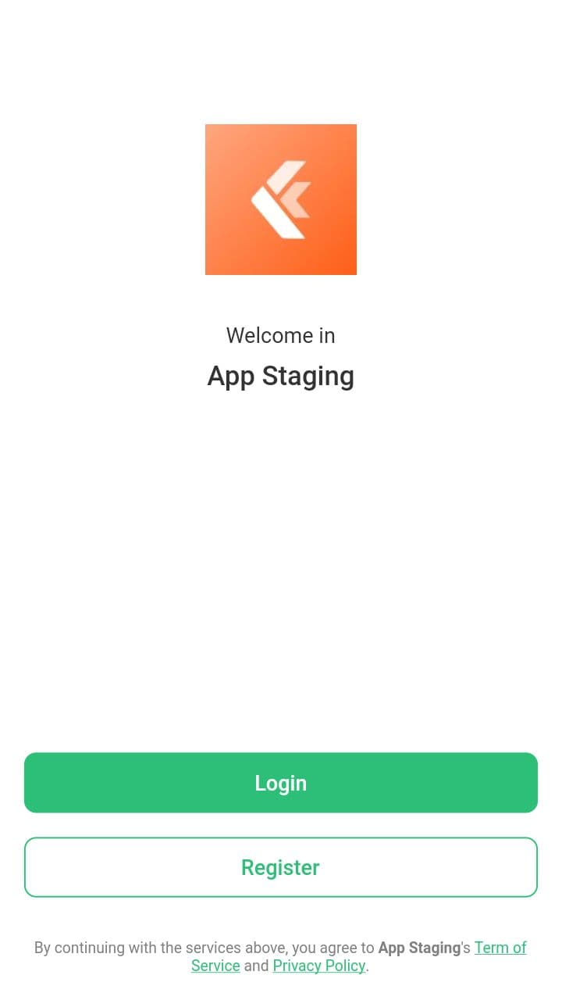

# Flutter-Works Boilerplate

[](https://pub.dev/packages/effective_dart)
[](https://github.com/felangel/bloc)
[](https://github.com/kodingworks/flutter-works-boilerplate)
[](https://github.com/kodingworks/flutter-works-boilerplate)
[](https://github.com/kodingworks/flutter-works-boilerplate)


## Table Of Content

- [Overview](#overview)
- [Getting Started](#getting-started)
  * [Requirement](#requirement)
  * [Setup](#setup)
- [Setup Firebase](#setup-firebase)
  * [Android](#android)
  * [IOS](#ios)
- [Change Package Name](#change-package-name)
- [Running/Debugger](#running-debugger)
  * [1. Mode Dev (Development)](#1-mode-dev--development-)
  * [2. Mode Staging](#2-mode-staging)
  * [3. Mode Prod (Production)](#3-mode-prod--production-)
  * [Jika Pengguna VS Code](#jika-pengguna-vs-code)
- [Features](#features)
- [Library / Dependency](#library---dependency)
- [Folder Structure](#folder-structure)
- [Module](#module)
  * [List Default Modules](#list-default-modules)
    + [Shared Module:](#shared-module-)
    + [Features Module:](#features-module-)
  * [Create Module](#create-module)
- [Global Config/Variable](#global-config-variable)
  * [Panggil Global Variable](#panggil-global-variable)
- [Penggunaan Translation/Localization](#penggunaan-translation-localization)
  * [Create Item Translation](#create-item-translation)
  * [Generate Translation](#generate-translation)
  * [Get Item Translation](#get-item-translation)
  * [Create Locale](#create-locale)
  * [Set Main Locale](#set-main-locale)
- [Generate Icon Launcher](#generate-icon-launcher)
- [Generate Native Splash Screen](#generate-native-splash-screen)


---

## Overview

Repositori ini adalah Sebuah project  Open-Source (Terbuka) yang diperuntukan untuk Boilerplate pada Flutter yang sangat mendukung produktifitas Anda, dengan banyak sekali fitur-fitur yang sudah kami siapkan secara instant yang dapat mempercepat dalam proses kerja Anda.

## Screenshot

| Theme | 1 | 2 | 3 | 4 | 5 |
--------|---|---|---|---|---|
Dark | |||| | 
Light | |||| | 

---

## Getting Started

### Requirement

Berikut beberapa hal yang perlu Anda persiapkan sebelum setup Boilerplate ini:

1. Flutter SDK Stable (Latest Version) [Install](https://flutter.dev/docs/get-started/install)
2. Android Studio [Install](https://developer.android.com/studio)
3. Visual Studio Code (Optional) [Install](https://code.visualstudio.com/)
4. Extension **Dart** dan **Flutter**:
    - Pengguna **Intellij Platform** ([Dart](https://plugins.jetbrains.com/plugin/6351-dart), [Flutter](https://plugins.jetbrains.com/plugin/9212-flutter))
    - Pengguna **Visual Studio Code** ([Dart](https://marketplace.visualstudio.com/items?itemName=Dart-Code.dart-code), [Flutter](https://marketplace.visualstudio.com/items?itemName=Dart-Code.flutter))

### Setup

Untuk menyiakan project Anda berdasarkan dengan boilplate ini, Anda perlu melakukan beberapa langkah-langkah yang perlu Anda lakukan. Untuk contoh simple implementasi bisa lihat di branch [example](https://github.com/kodingworks/flutter-works-boilerplate/tree/example/)

Berikut langhkah-langkah untuk menyiapkan Project dengan boilerplate Flutter-Works ini:

**Step 1:**

Pada langkah ini Anda perlu mengunduh(cloning) file dari repository ini ke lokal kompoter Anda:

```bash
git clone http://github.com/kodingworks/flutter-works-boilerplate.git
```

Atau 

```bash
git clone git@github.com:kodingworks/flutter-works-boilerplate.git
```

**Step 2:**

Langkah selanjutnya buka folder yang telah di unduh/clone ke aplikasi cli seperti `bash`, `cmd`, `terminal` . 

Dan kemudian jalankan perintah ini ke console:

```bash
flutter pub get
```

## Setup Firebase

Karena pada boilerplate ini banyak sekali menggunkan teknologi yang dari firebase, maka Anda perlu mengkonfigurasinya terlebih dahulu sebelum Anda menjalankan aplikasi tersebut pertama kalinya. Berikut contoh/tutorial cara setup firebasenya:

### Android

1. Langkah pertama setup firebase pada Android yaitu create project anda terlebih dahulu di [firebase console](https://console.firebase.google.com/)


2. Download `google-services.json` sesuai dengan flavor dan package name masing-masing. Cek [Change Package Name](#change-package-name)


3. Aktifkan authentikasi lewat google pada firebase console.


4. Buat sample remote config version

### IOS

TODO: Implement Tutorial Setup Firebase IOS


## Change Package Name

Secara default package name:

Prod: io.kodingworks
Dev: io.kodingworks.dev
Staging: io.kodingworks.staging


Untuk ganti package name cukup search semua `io.kodingworks.`, kemudian replace dengan nama package name yang baru, misal: `com.mycompany.`  .


## Running/Debugger

Pada boilerplate ini sudah tersedia beberapa `flavor` yang memungkinkan Anda menjalankan beberapa tipe misal untuk mode `pengembangan`, `produksi`, dan masih banyak lagi. Di boilerplate ini secara default menyediakan boilerplate flavor untuk **Android** dan **IOS**. Berikut tipe-tipe flavor yang sudah kami konfigurasi:

### 1. Mode Dev (Development)

Pada flavor ini diperuntukkan hanya untuk test, dan debugging pada saat pengerjaan(development). Untuk menjalankan pada flavor ini Anda cukup jalankan perinta ini:

```bash
flutter run -t lib/main_dev.dart --flavor dev
```

### 2. Mode Staging

Pada flavor ini diperuntukkan pada mode demo:

```bash
flutter run -t lib/main_staging.dart --flavor staging
```

### 3. Mode Prod (Production)

Pada flavor ini diperuntukkan hanya pada release mode (untuk digunakan oleh user beneran):

> **Saran:** Pada flavor ini jangan diperuntukan untuk test, demo.

```bash
flutter run -t lib/main_staging.dart --flavor staging
```

### Jika Pengguna VS Code


Jika Anda adalah pengguna VS Code sebagai alat/tool dalam pengembangan app ada Flutter gunakan launch config yang sudah kami sediakan tinggal pilih flavor apa yang Anda ingin jalankan.

> Kelebihan dari menggunakan VS Code yaitu: Anda dapat melakukan breakpoint tiap line code lebih mudah dibanding menggunkan cli.


## Features

| Feature | Android | IOS |
----------|---------|-----|
Multiple Language | ✔️ | ✔️ |
Dark Mode/Multiple Themes | ✔️ | ✔️ |
Google Analytic | ✔️ | ✔️ |
Firebase Perfomance | ✔️ | ✔️ |
Firebase Remote Config | ✔️ | ✔️ |
Firebase Push Notification | ✔️ | ⚠️ |
Firebase Authentication | ✔️ | ✔️ |
Login With Google | ✔️ | ✔️ |
Login With Apple | ❌ | ⚠️ |
Version Check | ✔️ | ✔️ |

## Library / Dependency

Pada boilerplate ini ada beberapa library yang kami tambahkan untuk menunjang produktifitas dalam pengerjaannya. Berikut daftar beberapa library yang sudah tersedia pada boilerplate ini berseta deskripsi dan versinya:

|Name                  |Deskripsi                                                                                        |Versi    |
|----------------------|-------------------------------------------------------------------------------------------------|---------|
|[dartz](pub.dev/packages/dartz)                 |Digunakan untuk Functional Programming.                                                          |`^0.9.2`   |
|[dio](pub.dev/packages/dio)                   |Sebagai library untuk mengatasi http request yang sangat beragam.                                |`^3.0.10`  |
|[equatable](pub.dev/packages/equatable)             |Untuk mengatasi komparasi dari object.                                                           |`^1.2.6`   |
|[flutter_bloc](pub.dev/packages/flutter_bloc)          |Sebagai library untuk mengatasi segala State Management yang sangat flexible.                    |`^6.1.2`   |
|[formz](pub.dev/packages/formz)                 |Digunakan untuk mengatasi validasi Form pada State Management yang mudah dan reusable.           |`^0.3.2`   |
|[get_it](pub.dev/packages/get_it)                |Library yang berfungi untuk mengatasi Dependency Injection.                                      |`^5.0.6`   |
|[hive](pub.dev/packages/hive)                  |Sebagai DataBase utama yang mengatasi berbagai dynamic data, dengan performa yang sangat optimal.|`^1.4.4+1` |
|[image_picker](pub.dev/packages/image_picker)          |Untuk mengatasi pengambilan gambar dari camera maupun gallery.                                   |`^0.6.7+22`|
|[rxdart](pub.dev/packages/rxdart)                |Untuk mengatasi reactiveX untuk asynchronous programming                                         |`^0.25.0`  |
|[url_launcher]((pub.dev/packages/url_launcher))          |Untuk mengatasi peluncuran berbagai URL/link ke berbagai aplikasi yang tersedia di App.          |`^5.7.10`  |
|[package_info](pub.dev/packages/package_info)          |Untuk mengambil dari data native App sekarang seperti versi, nama aplikasi, dll.                 |`^0.4.3+4` |
|[firebase_auth](pub.dev/packages/firebase_auth)         |Untuk mengatasi authentikasi dari firebase.                                                      |`^0.20.0+1`|
|[firebase_core](pub.dev/packages/firebase_core)         |Library utama dari Firebase SDK untuk Flutter                                                    |`^0.7.0`   |
|[firebase_crashlytics](pub.dev/packages/firebase_crashlytics)  |Library yang berfungsi untuk mencatat berbagai masalah error code, BUG, yang tersedia dalam App. |`^0.4.0+1` |
|[firebase_messaging](pub.dev/packages/firebase_messaging)    |Untuk mengatasi notifikasi yang dari firebase console.                                           |`^8.0.0-dev.14` |
|[firebase_performance](pub.dev/packages/firebase_performance)    |Untuk mencatat performa aplikasi kita dan request http di berbagai device yang dikimkan ke Firebase Console.                                           |`^0.5.0+1` |
|[firebase_remote_config](pub.dev/packages/firebase_remote_config)|Untuk mengambil data configurasi dari firebase console, dengan value yang dynamic.               |`^0.6.0`   |
|[google_sign_in](pub.dev/packages/google_sign_in)        |Mengatasi login melalui google berdasarkan dari firebase.                                        |`^4.5.9`   |


## Folder Structure

```md
flutter_modular/
┣ .vscode/
┃ ┗ launch.json
┣ android/
┣ assets/
┃ ┣ cfg/
┃ ┃ ┣ dev_env.json
┃ ┃ ┣ prod_env.json
┃ ┃ ┗ stagging_env.json
┃ ┣ fonts/
┃ ┗ images/
┣ features/
┃ ┣ auth/
┃ ┃ ┣ lib/
┃ ┃ ┣ test/
┃ ┃ ┗ pubspec.yaml
┃ ┣ home/
┃ ┃ ┣ lib/
┃ ┃ ┣ test/
┃ ┃ ┗ pubspec.yaml
┃ ┗ settings/
┃ ┃ ┣ lib/
┃ ┃ ┣ test/
┃ ┃ ┗ pubspec.yaml
┣ ios/
┣ launcher/
┃ ┣ ic_foreground.png
┃ ┣ ic_launcher.png
┃ ┗ logo_splash.png
┣ lib/
┃ ┣ app.dart
┃ ┣ flavors.dart
┃ ┣ main_dev.dart
┃ ┣ main_prod.dart
┃ ┣ main_staging.dart
┃ ┣ module.dart
┃ ┗ routes.dart
┣ shared/
┃ ┣ component/
┃ ┣ core/
┃ ┣ dependencies/
┃ ┣ l10n/
┃ ┗ preferences/
┣ test/
┣ analysis_options.yaml
┣ pubspec.yaml
┗ README.md
```

## Module

Karena pada project boilerplate ini adalah bersifat modular, jadi tiap feature perlu dipecah jadi module sendiri-sendiri. Jadi ini sangat memungkinkan jika Anda bekerja bersama tim, proses pengerjaan kode jadi lebih mudah dan terstruktur karena tiap anggota bisa mengerjakan dengan fokus di module yang mereka kerjakan. 

### List Default Modules

Secara default ketika Anda menggunakan boilerplate ini, terdapat beberapa module yang sudah terpasang secara otomatis, berikut daftar module-module yang sudah tersedia:

#### Shared Module:

| Name | Description|
-------|------------|
[core](/shared/core) | Sebuah module yang memuat class, function globa dan inti |
[component](/shared/component) | Sebuah module yang memuat global component, yang sifatnya tidak merender untuk spesifik module tertentu |
[dependencies](/shared/dependencies) | Sebuah module yang memuat beberapa global dependency/library yang dijadikan satu package |
[l10n](/shared/l10n) | Sebuah module yang memuat data translasi |
[preference](/shared/preference) | Sebuah module yang memuat tentang macam-macam gaya aplikasi, dan yang berhubungan dengan UI(User Interface) |

#### Features Module:

| Name | Description|
-------|------------|
[auth](/features/auth) | Sebuah module yang diperuntukan untuk mengatasi bagian authentikasi pada aplikasi |
[home](/features/home) | Sebuah module yang diperuntukan untuk Home |
[profile](/features/profile) | Sebuah module yang diperuntukan untuk Profile Management |
[settings](/features/settings) | Sebuah module yang diperuntukan untuk mengatasi berbagai fitur setting pada app |

### Create Module

Ketika Anda membuat fitur baru yang dimana fitur tersebut mampu berjalan dengan sendiri tanpa ketergantungan sekali dengan fitur lain, Anda bisa membuat module terpisah sebagai module fitur terbaru Anda. Berikut contoh cara setup module baru:

**Step 1:** Copy template module.

Untuk template module sudah tersedia yang berada di root folder dengan nama folder `template_module`. Copy folder `template_module` tersebut ke destinasi/lokasi module di letakkan. Jika module tersebut adalah `feature` maka taruh module tersebut di dalam folder `/features`.

```
├── features/
```

**Step 2:** Rename Nama Module.

Langkah selanjutnya yaitu Anda perlu ganti nama module sesuai dengan feture Anda. Misal jika module tersebut adalah fitur `payment`, maka:

**Before:**

```
├─ features/
│  └─ template_module/
│    └─ lib/
│      └─ name_module.dart
```

**After:**

```
├─ features/
│  └─ payment
│    └─ lib/
│      └─ payment.dart
```

Pada file `lib/payment.dart`:

**Before:**

```dart
// TODO: change name module
library module;

export 'src/data/data.dart';
export 'src/domain/domain.dart';
export 'src/module.dart';
export 'src/presentation/presentation.dart';

```

**After:**

```dart
library payment;

export 'src/data/data.dart';
export 'src/domain/domain.dart';
export 'src/module.dart';
export 'src/presentation/presentation.dart';

```

Pada file `lib/src/module.dart`:

**Before:**

```dart
import 'package:core/core.dart';
import 'package:flutter/cupertino.dart';
import 'package:flutter/material.dart';
import 'package:get_it/get_it.dart';

// TODO: Change Your Name Module
class NameModule implements BaseModule {
  @override
  void inject(GetIt getIt) {
    // Data

    // Domain

    // Presentation
  }

  @override
  Map<String, Route> routes(RouteSettings settings) {
    return {
      // Routes data in module
    };
  }
}
```

**After:**

```dart
import 'package:core/core.dart';
import 'package:flutter/cupertino.dart';
import 'package:flutter/material.dart';
import 'package:get_it/get_it.dart';

class PaymentModule implements BaseModule {
  @override
  void inject(GetIt getIt) {
    // Data

    // Domain

    // Presentation
  }

  @override
  Map<String, Route> routes(RouteSettings settings) {
    return {
      // Routes data in module
    };
  }
}
```


Pada file `pubspec.yaml`:

**Before:**

```yaml
# TODO: change name module
name: module
description: A new Flutter package project.
version: 0.0.1
author: "My Name"
homepage: "https://example.com"

environment:
  sdk: ">=2.7.0 <3.0.0"
  flutter: ">=1.17.0"

dependencies:
  flutter:
    sdk: flutter
  # TODO: UnComment & fix change path package
  # core:
  #   path: ../../shared/core
  # component:
  #   path: ../../shared/component
  # dependencies:
  #   path: ../../shared/dependencies
  # l10n:
  #   path: ../../shared/l10n
  # preferences:
  #   path: ../../shared/preferences
  

dev_dependencies:
  flutter_test:
    sdk: flutter
  effective_dart: ^1.3.0

flutter:
```

**After:**

```yaml
name: payment
description: A new Flutter package project.
version: 0.0.1
author: "My Name"
homepage: "https://example.com"

environment:
  sdk: ">=2.7.0 <3.0.0"
  flutter: ">=1.17.0"

dependencies:
  flutter:
    sdk: flutter
  
  core:
    path: ../../shared/core
  component:
    path: ../../shared/component
  dependencies:
    path: ../../shared/dependencies
  l10n:
    path: ../../shared/l10n
  preferences:
    path: ../../shared/preferences

dev_dependencies:
  flutter_test:
    sdk: flutter
  effective_dart: ^1.3.0

flutter:
```

**Step 3:** Daftarkan module ke root project.

Untuk mendaftarkan module feature yang pernah kita buat itu wajib, karena jika tidak kita daftarkan besar kemungkinan akan terjadi error. Untuk mendaftarkannya lihat berikut contohnya:

Langkah pertama pasang module tersebut di `pubspec.yaml` pada root project.


```yaml
dependencies:
  flutter:
    sdk: flutter
  
  ...

  payment: 
    path: features/payment
  
dev_dependencies:
...

```

Sesuaikan dengan lokasi module Anda, pada contoh diatas module berada di dalam folder `/features` maka pathnya adalah `features/payment`.

Kemudian buka file `lib/module.dart`, dan tambahkan class Module yang Anda buat tadi. contoh: 

```dart
...

List<BaseModule> appModules = [
  AuthModule(),
  HomeModule(),
  SettingsModule(),
  PaymentModule(), // New Module
];

```

Pada contoh tersebut `PaymentModule` adalah module terbaru yang telah dibuat. Setelah selesai jalankan ulang aplikasi Anda.

## Global Config/Variable
Semua konfigurasi yang sifatnya global di simpan berupa `env` yang pada kasus ini kami menyimpanya di folder `assets/cfg/`.

Didalam folder tersebut terdapat beberapa file konfigurasi yang sebelumnya tersedia yaitu:

- dev_env.json
- prod_env.json
- stagging_env.json

Pada tiap item tersebut memuat konfig yang berbeda-beda berdasarkan dari nama flavornya, misa jika flavornya `dev` maka namanya `dev_env.json`.

Untuk format konfigurasinya kami simpan berupa format file dengan extensions `json` karena config `json` yang paling mudah dibaca oleh Flutter itu sendiri.

Berikut contoh yang ada di konfigurasi env nya:

```json
{
    "base_url": "https://example.co.id/v2",
    "app_name": "App",
    "encrypt": "AlOp7lBkcFRdJnXFkGcBHwM9I9TJMMas",
    "version_name": "1"
}
```

Pada contoh diatas semua variable tersebut itu adalah variable global, maupun variable konfigurasi enable/disable fitur.

**Note**: Ketika ada perubahan dalam file konfigurasi, tidak dapat melakukan hot reload data, dan Anda wajib melakukan restart debug. Hal ini terjadi karena setiap konfigurasi itu di muat pada saat pertama kali peluncuran aplikasi, atau pada saat method `main()` pada dart dijalankan pertama kali.

### Panggil Global Variable

Untuk memanggil Global Variable Anda perlu menggunakan class `GlobalConfiguration` dan class `GlobalConfiguration` adalah bagian dari module `core`. Berikut contoh penggunaanya:

```dart
import 'package:core/core.dart';
import 'package:dependencies/dependencies.dart';

....

final appName = GetIt.I<GlobalConfiguration>().getValue('app_name');

print(appName);
....
```

## Penggunaan Translation/Localization

Untuk data translation berada pada module `l10n` yang letaknya di `/shared/l10n`. Semua data translasi pada app Anda dimuat di module ini. Secara default bahasa yang di dukung sudah 2, yaitu bahasa **Indonesia** dan **English**.

### Create Item Translation

Untuk membuat item translasi Anda perlu generate dari kode `arb` ke `dart`. Tapi jagan khawatir pada boilerplate ini sudah tersedia fitur generate translasi, untuk data-data translasi Anda bisa cek di folder `lib/l10n` yang berada di module `l10n`, yang filenya berextension `.arb`. Untuk contohnya bisa lihat ini:

```json
{
  "hello": "Hello World"
}
```

Jadi pada extension `.arb` format data sama persis dengan format `.json` jadi pastinya lebih familiar lagi. Dimana tiap item tersebut mempunyai `key` dan `value`. Pada contoh di atas `"hello"` adalah sebagai `key` dan `"Hello World"` adalah sebagai value.

- `key` adalah sebagai nama variable yang akan digenerate
- 'value` adalah text yang akan di tampilkan tiap bahasa masing-masing

> **Note:** jika membuat translasi pastika semua bahasa `key` itu ada di semua bahasa yang ada di folder `lib/l10n`

**Jika Ingin menambahkan param di translasi **

```json
{ // intl_en.arb
  "hello": "Hello my name is {name}"
}
```

```json
{ // intl_id.arb
  "hello": "Halo namaku adalah {name}"
}
```

Dimana pada tanda `{}` tersebut berarti ada input param jika dipanggil.

> **Note:** Pastikan jika Anda menambahkan param/plural di item translasi Anda wajib menambahkanya di semua localization bahasanya

### Generate Translation

Setiap kali ada perubahan sekecil apapun yang ada di folder `lib/l10n` yang berada di module `l10n` maka Anda perlu mengenerate ulang kode, supaya hasil kodenya bisa terbaru. Untuk mengenerate anda cukup gunakan perintah seperti ini:

```bash
./generate_l10n.sh
```

### Get Item Translation

Jika ingin panggil item translasi Anda perlu import terlebih dahulu module `l10n`. Dan tiap pemanggilan translasi Anda perlu panggil main class nya yaitu `S`. Contoh:

```dart
import 'package:l10n/l10n.dart';

...
S.current.hello; // Hello World
...

```

Jika Ada param:

```dart
import 'package:l10n/l10n.dart';

...
S.current.hello('Flutter'); // Hello My Name is Flutter
...

```

### Create Locale

Untuk membuat translasi yang mendukung bahasa lain, Anda perlu membuat file tambahan pada module `l10n` dan di folder 'lib/l10n'. Dengan format:

```
intl_{language_code}.arb
```

Buat file dengan format seperti diatas, atau juga bisa mengcopy dari salah satu localization lain, dengan rename sesuai kode bahasanya.

> Jangan lupa setelah membuat bahasa lain, Anda perlu generate ulang.

### Set Main Locale

Untuk setting default bahasa apa yang digunakan, jika bahasa tersebut tidak/belum Anda dukung pada suatu negara maka Anda perlu custom confignya. Secara default config default locale di set dalam bahasa `english`, Jika ingin custom bisa cek di `pubspec.yaml` pada `shared/l10n/pubspec.yaml`. Untuk contoh confignya seperti ini:


```yaml
flutter_intl:
  enabled: true
  main_locale: en
```

Pada contoh tersebut `main_locale` dengan value `en`, berarti `en` tersebut code bahasa yang berarti bahasa **English**. Selengkapnya cek [di sini](https://en.wikipedia.org/wiki/List_of_ISO_639-1_codes) Untuk mengetahi daftar kode bahasa di seluruh dunia.


## Generate Icon Launcher

Secara default di boilerplate ini sudah custom icon launchernya, tapi jika ingin custom sesuai dengan keinginan Anda sendiri, Anda perlu custom terlebih dahulu gambar icon-icon yang ingin Anda jadikan sebagai Icon Launcher. Secara default telah disediakan template ukuran icon, berada di folder [/launcher](/launcher).

**Step 1:**

Dan untuk konfigurasi nya berada di file `pubspec.yaml` pada root project. Berikut contoh konfignya:

```yaml
flutter_icons:
  android: "ic_launcher"
  ios: true
  image_path_android: "launcher/ic_launcher.png"
  adaptive_icon_background: "#E67442"
  adaptive_icon_foreground: "launcher/ic_foreground.png"
  image_path_ios: "launcher/ic_launcher.png"
```

Untuk info lebih bisa lihat di [pub.dev](https://pub.dev/packages/flutter_launcher_icons).

**Step 2:**

Dan untuk generete iconnya Anda perlu jalankan perintah seperti ini:

```bash
flutter pub run flutter_launcher_icons:main
```

**Step 3:**

Karena package `flutter_launcher_icons` ini generate icon launcher pada Android hanya pada `main` saja, belum sampai ke per item flavor, Jadi Anda perlu konfigurasi manual ulang lagi untuk set icon pada tiap flavor di Android.


1. Copy folder `res` yang berada di `/android/app/main/res`


2. Paste dan replace ke folder flavor tujuan Anda. 

Kemudian jalankan ulang aplikasi Anda.

## Generate Native Splash Screen

Info selengkapnya lihat di [pub.dev](https://pub.dev/packages/flutter_native_splash), dan Setelah tergenerate copy ulang folder `res` ke tiap item flavor sama seperti generate `icon_launcher`.